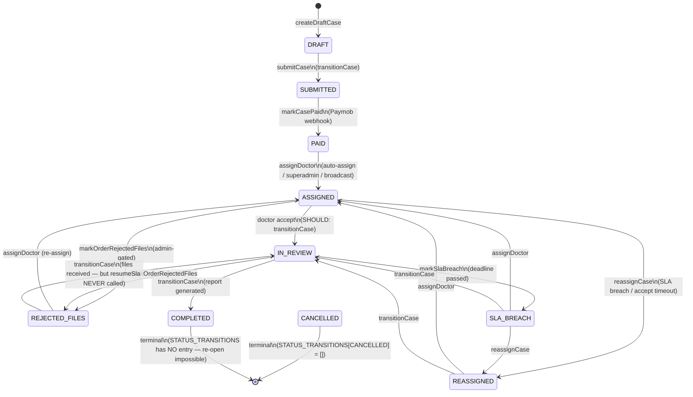
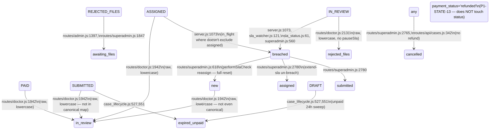

# Theme 7 — State Machine Inconsistency: Fix Plan

**Date:** 2026-05-09
**Author:** Claude Opus 4.7 (1M context)
**Working tree HEAD:** `5b28ea1` (Theme 4 env-var scoping shipped)
**Sources:** `docs/audits/COMPREHENSIVE_PRE_LAUNCH_AUDIT_2026-05-06.md` § Section 04 — Order state machine audit (findings P0-STATE-1..4, P1-STATE-5..15, P2-STATE-16..24, P3-STATE-25); verified directly against the live `5b28ea1` codebase for this scoping.

> Scoping document only. **No source files have been modified.** Diffs in §4 are *proposed*, not applied. Per Theme 5's just-landed `client`-threading work, none of the proposed changes touch `case_lifecycle.js` writers (only signature-compatible additions).

---

## ⚠️ ALERT — One critical refund-loophole class needs Ziad's product call before §4 lands

The scoping turned up **one CRITICAL-class issue** that is more "missing feature" than "defective code", and so does not fit the BLOCK-finding bar from `AUDIT_GROUND_RULES.md`. Flagging it at the top because it shapes the §4 fix order:

**The platform takes patient money via Paymob, but cannot return it.** `services/paymob.js` exposes `createIntention` and `verifyPaymobHmac` only — no `refund()`. `services/sla_breach.js:97` carries an explicit `TODO(paymob): trigger Paymob actual-money refund` that has never been wired. Every `refunds` row written to date — by SLA breach hooks, by superadmin "set payment_status=refunded", by future patient cancel — records *intent* and zeroes the doctor's uplift share, but **no money leaves Tashkheesa's Paymob merchant account**. The first patient who pays, then needs a refund, is a manual ops job (Paymob dashboard), not a code path. Until Theme 7 sub-issue C lands a Paymob refund client, any cancel-with-refund flow we ship is half-built. See §3 root-cause-2 and OQ-1.

This is **not** the "cases can be marked paid AND cancelled simultaneously" scenario the brief named — that exact race does not exist (the `markCasePaid` `SELECT FOR UPDATE` serializes paid-side mutations correctly). But the financial blast-radius is comparable: a refund the user is promised that never actually leaves the platform is functionally indistinguishable from a refund-loophole, just inverted (we keep the money instead of giving it twice).

---

## 1. Executive summary

The audit's Section 04 catalogues 25 state-machine findings driven by one architectural pattern: a clean canonical lifecycle (`case_lifecycle.js` — `transitionCase` + `assertCanonicalDbStatus` + `STATUS_TRANSITIONS` map + invariant guards) coexists with five categories of legacy raw-SQL paths that bypass it. Theme 7's four named sub-issues are concrete instances of that pattern.

**Sub-issue A** — `routes/doctor.js:1942-1957` does a single raw `UPDATE orders SET status='in_review'` for doctor accept. It skips the canonical `transitionCase(IN_REVIEW)` path, which means: no `assertCanonicalDbStatus` (the doctor accept path *writes lowercase 'in_review'* into a column whose canonical value is `'IN_REVIEW'` — only `normalizeStatus` salvage masks the casing drift); no `assertPaidGate` (the route inlines its own `payment_status === 'paid' || 'captured'` check, weaker than the lifecycle's `payment_due_at`-aware gate); no `closeOpenDoctorAssignments` (so `doctor_assignments.completed_at` for the *prior* assignment row is left open, polluting capacity counts via `pickNextAvailableDoctor`); no `case_events:status:IN_REVIEW` row; no `notifyCaseAssigned` email. The capacity-overflow auto-reassign branch (lines 1907-1937) is a second raw `UPDATE orders SET doctor_id=$1` with the *same* problems plus no `accept_by_at` window for the new doctor. Deadline backfill is done via a *separate* raw `UPDATE` post-transition — partial-failure leaves a case in `'in_review'` with `deadline_at` NULL, indistinguishable from a paused-SLA case.

**Sub-issue B** — Five SLA-breach implementations write to `orders.status`, not three. The audit named three; investigation found two more. Canonical: `case_sla_worker.runCaseSlaSweep` (calls `markSlaBreach` → `transitionCase(SLA_BREACH)`) and `case_lifecycle.sweepSlaBreaches` (also calls `markSlaBreach`). Legacy raw-SQL: `server.js:runSlaReminderJob` (line 1073), `sla_watcher.runSlaSweep` (line 119-126), `sla_status.enforceBreachIfNeeded` (line 60-66), and `routes/superadmin.js:performSlaCheck` (line 558-565). A sixth file, `sla_worker.js:detectBreaches` (line 86), exists but server.js:105 explicitly disables its loader. Four of these run concurrently in production: the canonical worker via pg-boss (or its setInterval fallback) every 5 minutes, plus `runSlaEnforcementSweep` which fires `runWatcherSweep` + `runSlaReminderJob` every 5 minutes (line 891), plus `enforceBreachIfNeeded` inline on every dashboard render (in `routes/admin.js`, `routes/doctor.js`, `routes/patient.js`, `routes/superadmin.js`), plus `performSlaCheck` triggered by superadmin via `/superadmin/run-sla-check`. The `breached_at IS NULL` guard prevents true double-marking; everything else (refund hooks, notifications, reassignment shape) is run-once-per-sweep and so multiplies as the sweeps overlap.

**Sub-issue C** — Two patient-cancel routes exist in code, but neither refunds money. Web-portal patient: zero. Mobile API (`/api/v1/cases/:id/cancel`, mounted via `api_v1.js:89`): exists but with three defects: (i) 10-minute window from `created_at`, predating any payment, so a paid cancel is immediately blocked; (ii) status guard `['submitted', 'under_review']` — `'under_review'` is not a real status anywhere in the system, the canonical name is `'IN_REVIEW'`, so this branch dead-codes itself; (iii) raw `UPDATE orders SET status='cancelled'`, no `transitionCase`, no `issueBreachRefundSafe`, no Paymob-refund call, no row in `refunds`. Superadmin cancel (`/superadmin/orders/:id/cancel`): same raw write, no refund, fires a "case cancelled" email. **No path in the entire codebase calls a Paymob refund API** — that integration does not exist in `services/paymob.js`. The `refunds` table records local intent; the actual money stays with Tashkheesa.

**Sub-issue D** — `'awaiting_files'` is a UI-only shadow status that has leaked into the database. `routes/admin.js:1397` and `routes/superadmin.js:1847` both `UPDATE orders SET status='awaiting_files'` when a superadmin/admin approves a doctor's "request additional files" flow. The string is **not** in `CASE_STATUS`, **not** in `STATUS_ALIASES`, **not** in `DB_STATUS_VARIANTS` — meaning if any code path read this row and called `transitionCase` on it, `assertCanonicalDbStatus` would throw. There IS a UI entry at `case_lifecycle.js:872` keyed `'AWAITING_FILES'` (separate from the canonical `CASE_STATUS_UI`), so the patient/doctor display copy renders correctly. Two consumers do read the `'awaiting_files'` row and treat it as live workload: `case_sla_worker.ACTIVE_STATUSES` (line 24) includes it for capacity counts, and `routes/superadmin.js:478,499` includes it in `selectSlaRelevantOrders`/`countOpenCasesForDoctor`. Capacity inflation aside, the case has no exit transition wired back to canonical — once it lands here, only an admin's manual UPDATE moves it, and the lifecycle's `pauseSla` runs nowhere because the path bypassed `markOrderRejectedFiles`. There is also a sibling state — `'expired_unpaid'`, written at `case_lifecycle.js:527,551` — that has the same drift: not in canonical, but written by lifecycle code itself (drift-of-the-drift).

**Sub-issue E** — Full state machine map below. One additional finding surfaced that the audit did not name: doctor reject-files (`routes/doctor.js:2129-2133`) writes `status='rejected_files'` raw and does NOT call `pauseSla` — so the SLA deadline keeps ticking while the patient is asked for files (P1-STATE-8 *almost* covers this; map adds the SLA-not-paused angle).

The Theme 7 fix is mechanical, not architectural — every legacy path has a clean canonical replacement that already exists. **Sub-issue C requires a Paymob refund client to be built first** (OQ-1). Estimated effort, in order: A (4h) → D (2h) → B (1.5d, large because of the inline `enforceBreachIfNeeded` callers) → C (1d for code, blocked on Paymob). Theme 7 is a strong candidate to split as Theme 7a (A+B+D, can ship independently) + Theme 7b (C, gated on Paymob refund integration).

---

## 2. Current state

### Sub-issue A — Doctor accept route bypasses `transitionCase`

**Location:** `src/routes/doctor.js:1942-1957` (primary write); `:1907-1937` (capacity-overflow auto-reassign branch); `:1962-1973` (post-transition deadline backfill).

**Verbatim handler shape (primary write, accept after capacity check):**

```js
// Canonical state transition — single source of truth
const nowIso = new Date().toISOString();

const result = await execute(
  `UPDATE orders
   SET doctor_id = $1,
       accepted_at = COALESCE(accepted_at, $2),
       status = 'in_review',
       updated_at = $3
   WHERE id = $4
     AND (doctor_id IS NULL OR doctor_id = '' OR doctor_id = $5)
     AND LOWER(COALESCE(status, '')) IN ('new','submitted','paid','assigned','accepted')`,
  [doctorId, nowIso, nowIso, orderId, doctorId]
);

if (!result || result.rowCount === 0) {
  return res.redirect(`/portal/doctor/case/${orderId}`);
}

// SLA model: deadline starts at acceptance.
try {
  await execute(
    `UPDATE orders
     SET deadline_at = accepted_at + (sla_hours || ' hours')::interval
     WHERE id = $1
       AND accepted_at IS NOT NULL
       AND sla_hours IS NOT NULL
       AND (deadline_at IS NULL OR deadline_at = '')`,
    [orderId]
  );
} catch (_) {}
```

**Verbatim handler shape (capacity-overflow auto-reassign branch, lines 1907-1937):**

```js
const activeCount = await countActiveCasesForDoctor(doctorId);

if (activeCount >= MAX_ACTIVE_CASES) {
  const nextDoctor = await findNextAvailableDoctor(order.specialty_id, doctorId);

  if (nextDoctor && nextDoctor.id) {
    await execute(`
      UPDATE orders
      SET doctor_id = $1, updated_at = $2
      WHERE id = $3
    `, [nextDoctor.id, new Date().toISOString(), orderId]);

    try {
      logOrderEvent({
        orderId, label: 'case_auto_reassigned_capacity',
        meta: { from_doctor: doctorId, to_doctor: nextDoctor.id },
        actorRole: 'system'
      });
    } catch (_) {}

    return res.redirect('/portal/doctor/dashboard');
  }
  return res.redirect(`/portal/doctor/case/${orderId}?msg=capacity`);
}
```

**Side-effects skipped vs canonical `transitionCase(caseId, IN_REVIEW)`:**

| Side effect | Canonical site | Skipped today? | Replacement in route? |
|---|---|---:|---|
| `assertCanonicalDbStatus(status)` | `case_lifecycle.js:1242` | YES | No — writes lowercase `'in_review'`; salvaged downstream by `normalizeStatus` |
| `assertPaidGate(existing, IN_REVIEW)` (`payment_due_at` window check + paid_at) | `case_lifecycle.js:5-29`, `:1236` | YES | Partial — inline `paymentStatus === 'paid' || 'captured'` at `:1883-1887`. **Does not check `payment_due_at`.** |
| `assertTransition(currentStatus, IN_REVIEW)` (PAID, ASSIGNED, REASSIGNED → IN_REVIEW only) | `:1217-1228`, `:1261` | YES | Partial — `LOWER(status) IN ('new','submitted','paid','assigned','accepted')` accepts `'submitted'` and `'new'` (which canonical → SUBMITTED), which canonical map *does not* allow as a from-state for IN_REVIEW |
| `accepted_at` backfill | `:1268-1273` | partially | route does set `accepted_at = COALESCE(accepted_at, $2)`, equivalent |
| `deadline_at = accepted_at + sla_hours` (atomic with status flip) | `:1275-1297` | YES — done in *separate* `UPDATE` *after* the status flip (`:1962-1973`) | Two-phase. Partial-failure between calls leaves `status='in_review'` with `deadline_at=NULL`, indistinguishable from a paused-SLA case. |
| `closeOpenDoctorAssignments(caseId)` (sets `doctor_assignments.completed_at`) | `:1299` | YES | Not invoked. The prior assignment row stays open → `pickNextAvailableDoctor` and `case_sla_worker.ACTIVE_STATUSES` count this case against doctor capacity *forever*, even after acceptance. |
| `case_events` row `status:IN_REVIEW` `{from: PAID/ASSIGNED}` | `:1309` | YES | Replaced by `logOrderEvent({label:'doctor_accepted_case'})` at `:1976`. Different table, different shape; lifecycle queries scanning `case_events` for status transitions miss this acceptance. |
| `dispatchSlaReminders(caseId)` cascade | `:1420` (called from `markCasePaid`, but acceptance is the moment SLA actually starts and the case should become eligible for the IN_REVIEW reminder thresholds) | YES | Not invoked. Reminder thresholds at 6h/24h-from-deadline never fire on accept. |
| `notifyCaseAssigned` email (route the patient sees from `assignDoctor`) | `:1900` (only on PAID→ASSIGNED) | n/a | The patient was already notified at PAID→ASSIGNED. The doctor is the actor here. **But** there is NO new "case is now under doctor review" notification on accept — the lifecycle's `case_events:status:IN_REVIEW` is what dashboards display. Route bypasses it. |
| `withTransaction` (atomic across all of the above) | `markCasePaid` model | YES | Each `execute` is its own auto-commit. A crash between `:1942` (status flip) and `:1962` (deadline UPDATE) leaves the orphan state above. |

**Capacity-overflow branch — additional skips:**

| Side effect | Canonical equivalent | Skipped today? |
|---|---|---:|
| Mark *original* (over-capacity) doctor's pending earnings as `'reassigned'` + write 10% partial-pay row | `reassignCase` calls `markPartialPayOnReassignment` (`case_lifecycle.js:1947`) | YES — but the original doctor here was never the *assigned* doctor; they were the one trying to accept while already over-cap. P1-FIN-2 partial-pay does not apply here. |
| Insert `doctor_assignments` row for the *new* doctor with `accept_by_at` window | `assignDoctor` (`:1850-1867`) | YES — the new doctor inherits the case via `UPDATE orders SET doctor_id=$1` only. They have no `accept_by_at` window, so `case_sla_worker.fetchDoctorTimeouts` never times them out. They may not even know the case exists. |
| Notify new doctor | `assignDoctor` (`:1849`) → `case_events`, plus broadcast/queue notification flows | YES — only `logOrderEvent('case_auto_reassigned_capacity')` is written. No internal/email/whatsapp queueNotification fires for the recipient. |
| Auto-create patient↔new-doctor conversation | `assignDoctor` (`:1874-1891`) | YES |

**git blame:** the bypass pattern predates the Theme 5 work (`0ed91dd`). The `client`-threading enabled by Theme 5 means the canonical replacement is now reachable from any handler that wants `withTransaction(async (client) => transitionCase(..., client))`.

### Sub-issue B — Five SLA-breach implementations co-exist

The audit named three. Investigation found five active paths, plus one disabled file. Table below enumerates each.

| # | Site | Trigger | Write shape | Side-effects | Canonical? |
|---|---|---|---|---|:---:|
| 1 | `case_sla_worker.runCaseSlaSweep` (`src/case_sla_worker.js:328-396`) | pg-boss `scheduleSlaSweep` (every 5 min) OR setInterval fallback at `server.js:883` (`!slaBoss → startCaseSlaWorker()`). | `markSlaBreach(caseId)` → `transitionCase(SLA_BREACH, {breached_at})` (`case_lifecycle.js:1463`). Writes canonical `'SLA_BREACH'`. | Idempotent (early-return if status already `SLA_BREACH`). Calls `reassignCase` (canonical, with partial-pay) on success. Fires `dispatchSlaBreach` + `sendSlaReminder` notifications. | ✓ |
| 2 | `case_lifecycle.sweepSlaBreaches` (`case_lifecycle.js:1512-1558`) | Dashboard refresh handlers and `/superadmin/sla/recalc`. Iterates candidates and calls `markSlaBreach` per-id. | Same as #1 — funnels through canonical `markSlaBreach`. | Same as #1. | ✓ |
| 3 | `server.js:runSlaReminderJob` (`src/server.js:1022-1104`) | `runSlaEnforcementSweep` setInterval (every 5 min, `:891`) + boot+1s. | Inside `withTransaction`: raw `UPDATE orders SET status='breached', breached_at=$2, updated_at=$3, sla_reminder_sent=true WHERE id=$4` (line 1073). Writes lowercase non-canonical `'breached'`. | Calls `issueBreachRefundSafe` (idempotent on refunds row + uplift>0). Fires `sla_breached_doctor` + `sla_breached_admin/superadmin` notifications with `dedupe_key=sla:breach:<id>:<role>`. **Does NOT call reassignCase** — never moves the doctor; the case sits in `'breached'` indefinitely until path #1 picks it up (which it won't, because #1 only scans `IN_REVIEW`/`REJECTED_FILES`). | ✗ |
| 4 | `sla_watcher.runSlaSweep` (`src/sla_watcher.js:29-218`) | `runSlaEnforcementSweep` setInterval (`:848`). Imported as `runWatcherSweep`. | Inside `withTransaction`: raw `UPDATE orders SET status='breached', breached_at=$1` (line 119-126). Writes lowercase non-canonical `'breached'`. Then raw `UPDATE orders SET doctor_id=$1, reassigned_count++` for the new doctor — does NOT change status, leaves it `'breached'`. | No `case_events`, no canonical event log. Fires `order_reassigned_from_doctor` / `_to_doctor` / `_sla_breached` queue notifications. **No `issueBreachRefundSafe`** call. **No partial-pay** for original doctor (P1-FIN-2 hook missed). New doctor has no `accept_by_at` window. Same orphan-earnings risk as P1-STATE-7. | ✗ |
| 5 | `sla_status.enforceBreachIfNeeded` (`src/sla_status.js:51-79`) | Inline in dashboard render code: `routes/admin.js:989,1278`, `routes/doctor.js:2916`, `routes/patient.js:1020,2524`, `routes/superadmin.js:1142,1284`. **Fires on every page load** that materialises an active order row (no rate limit). | Raw `UPDATE orders SET status='breached', breached_at=COALESCE(breached_at, $1)` (line 60-66). Writes lowercase non-canonical `'breached'`. | Fires `issueBreachRefundSafe` (idempotent — refunds-row gate). **No notifications** queued — silent breach. **No reassign** — the case stays on the doctor's queue. | ✗ |
| 6 | `routes/superadmin.js:performSlaCheck` (`src/routes/superadmin.js:538-700`) | Manual: `/superadmin/run-sla-check` (`:2867`), `/superadmin/tools/run-sla-check` (`:2877`), and the audit's P2-ROUTE-16 GET-mutating equivalents. | Raw `UPDATE orders SET status='breached', breached_at=$1` (`:558-565`). Writes lowercase. THEN raw `UPDATE orders SET doctor_id=$1, status='new', accepted_at=NULL, deadline_at=NULL, reassigned_count++` (`:615-625`). | Fires `sla_breached_doctor`, `order_breached_superadmin`, `order_breached_patient` queue notifications. **Resets the case to `'new'` after reassignment** — the new doctor sees a brand-new case with no prior history visible in the status, and the SLA window starts from acceptance with a *fresh* `sla_hours`. The audit captured this exact pathology at P0-STATE-2: "a doctor who accepts the next moment lands on a brand new SLA window with no event trail of the prior breach." | ✗ |
| 7 (disabled) | `sla_worker.detectBreaches` + `autoReassign` (`src/sla_worker.js:71-158`) | Disabled at `server.js:105` with comment `// var { startSlaWorker, runSlaSweep } = require('./sla_worker'); — consolidated on case_sla_worker.js`. The file is still on disk; module not loaded. | Same raw `UPDATE orders SET status='breached'` then `status='accepted'` reassign. | Dead code. | ✗ |
| 8 (also live) | `src/jobs/sla_watcher.js:runOnce` (different from `src/sla_watcher.js`) | **Not loaded.** `grep require.*jobs/sla_watcher` returns zero. Disabled by being uncalled. | Raw `UPDATE orders SET breached_at=$1` (line 54-61) — does NOT touch `status`. | Dead code. | ✗ |

**End-state divergence matrix** for the four live legacy paths (#3-6) on the same overdue case:

| Behaviour | #1 canonical | #3 server.js | #4 sla_watcher | #5 enforceBreach | #6 performSlaCheck |
|---|:---:|:---:|:---:|:---:|:---:|
| Writes `status` value | `'SLA_BREACH'` | `'breached'` | `'breached'` | `'breached'` | `'breached'` then `'new'` |
| Sets `breached_at` | ✓ | ✓ | ✓ | ✓ | ✓ |
| `case_events` row `status:SLA_BREACH` | ✓ | ✗ (`order_events` only) | ✗ | ✗ | ✗ |
| Fires `issueBreachRefundSafe` | ✗ — only via the route's caller | ✓ | ✗ | ✓ | ✗ |
| Calls canonical `reassignCase` (partial-pay, doctor_assignments closure, accept_by_at) | ✓ | ✗ no reassign | ✗ raw doctor_id swap | ✗ no reassign | ✗ raw doctor_id swap + status reset |
| Notifies original doctor | via `sendSlaReminder` | `sla_breached_doctor` queueNotification | `order_reassigned_from_doctor` | none | `sla_breached_doctor` |
| Notifies new doctor | via `assignDoctor` | n/a (no reassign) | `order_reassigned_to_doctor` | n/a | none directly (falls to `assignDoctor` indirectly only if path then runs canonical, which it does not) |
| Notifies patient | none direct (case-events feed) | none | none | none | `order_breached_patient` |
| Notifies admin/superadmin | `dispatchSlaBreach` | `sla_breached_admin/superadmin` per role | `order_reassigned_sla_breached` | none | `order_breached_superadmin` |

**Race conditions:**

- All five mutating paths gate on `breached_at IS NULL` (or status not already `'breached'`/`'SLA_BREACH'`), so the `UPDATE` itself is single-fire per case. Good.
- The **non-`UPDATE` side-effects are not gated** — `issueBreachRefundSafe` is idempotent (refunds-row check); but #4's `reassignCase`-equivalent raw UPDATE has no idempotency, and if #4 fires on a case that #5 just marked breached, #4 will silently swap the doctor without partial-pay or notifications. The audit captured this at P2-STATE-19: "logic is fragile and maintenance is high; one missed `WHERE breached_at IS NULL` check in any path = double refund."
- `runSlaEnforcementSweep` (`server.js:833-862`) sets `slaEnforcementRunning = true` to prevent re-entry into itself, but that flag does NOT cover #1 (`case_sla_worker` runs separately) or #5 (inline page-load fires). So a dashboard load by an admin while the canonical sweep is mid-flight can race.
- Different `WHERE` clauses across paths leak rows past each other:
  - #1 canonical: `LOWER(status) IN (in_review, rejected_files)` only (`case_sla_worker.js:168`).
  - #3 server.js: `IN_FLIGHT_WHERE` excludes `completed/cancelled/canceled/rejected` only — *includes* `assigned`, `paid`, `submitted`. A case with deadline_at past, status `assigned` (doctor assigned but never accepted), gets marked `'breached'` by #3 but not by #1. Canonical never observes the breach.
  - #4: `status IN (new, accepted, in_review)` — picks up legacy `'accepted'` and `'new'` but not canonical `'IN_REVIEW'` (because `'in_review'` matches but `'IN_REVIEW'` does not under `=`; `LOWER` not used). Verified in source.
  - #5: any status not `completed`/`breached`. The widest net.

### Sub-issue C — Patient-cancel-with-refund flow

**Search results — every cancel-related route in the codebase:**

| Route | File:line | Auth | Does it refund? | Status guard | Cancel writes |
|---|---|---|:---:|---|---|
| `POST /api/v1/cases/:id/cancel` | `src/routes/api/cases.js:319-350` | mobile JWT (patient self) | ✗ | `[submitted, under_review]` (`'under_review'` is not a real status anywhere) + 10-min window from `created_at` | raw `UPDATE orders SET status='cancelled' WHERE id=$1` + `INSERT INTO order_timeline` row |
| `POST /superadmin/orders/:id/cancel` | `src/routes/superadmin.js:2757-2801` | superadmin | ✗ | none (cancels from any state) | raw `UPDATE orders SET status='cancelled', updated_at=NOW()` + `logOrderEvent('Order cancelled by superadmin')` + `notifyCaseCancelled` email |
| `POST /api/orders/:orderId/addons/:addonServiceId/cancel` | `src/routes/addons.js:67` | patient/admin | ✗ for orders; addon-only refunds for video/prescription | addon-level only | `UPDATE order_addons SET status='cancelled'` only — does not touch `orders.status` |
| `POST /portal/video/appointment/:id/cancel` | `src/routes/video.js:549-612` | patient/doctor | partial: marks `appointments.status='cancelled'` and `video_calls.status='cancelled'`, no actual refund. The video-consult addon's `onRefund` (`src/services/addons/video_consult.js:97`) sets `order_addons.status='refunded'` + `refund_pending=true` — same intent-only pattern. | appointment-only | does not touch `orders.status` |

**Web-portal patient (the place an actual paid patient would cancel from):** zero routes. `grep router.post.*cancel src/routes/patient.js` returns none. The patient dashboard / order detail view does not render a cancel button.

**Paymob refund integration:** does not exist. `services/paymob.js` exposes `createIntention`, `verifyPaymobHmac`, `_assertTestMode`, and helpers — that's it. The architecture is set up for a refund client (`refunds.paymob_refund_id` column at `migrations/028_refunds_table.sql:33`, the `TODO(paymob)` comment at `services/sla_breach.js:97-100`), but no implementation has landed. Every `INSERT INTO refunds` row written by the codebase has `paymob_refund_id = NULL`.

**Today's behaviour for "patient pays, then wants to cancel":**
1. Patient clicks Pay → Paymob takes the money, `markCasePaid` runs, status becomes `PAID`.
2. Patient changes mind → no UI affordance.
3. Patient contacts support → support runs `/superadmin/orders/:id/cancel` → status flips to `'cancelled'`, email sent.
4. **The money stays on Tashkheesa's Paymob merchant account.** Refund is a manual op via Paymob dashboard. No `refunds` table row, no audit trail, no reconciliation.

**Other gaps the audit flagged that touch this flow:**
- `payment_status='refunded'` is a permitted superadmin write (P1-STATE-13) but updates only the `payment_status` column — no `status` change, no refund-row insert, no Paymob call. Two routes that look like they'd refund (`/superadmin/orders/:id/payment` at `:2649` and `/superadmin/orders/:id/cancel` at `:2757`) do not coordinate.
- `payment_status` and `status` can drift (P2-STATE-18): the webhook sets `payment_status='paid'` *outside* the `markCasePaid` transaction (`payments.js:357`), so a crash between the two leaves a row with money taken and lifecycle never advanced.

### Sub-issue D — `'awaiting_files'` state drift

**Writers (raw `UPDATE orders SET status='awaiting_files'`):**

| Site | Trigger | Verbatim |
|---|---|---|
| `src/routes/admin.js:1397` | Admin approves doctor's "request additional files" | `UPDATE orders SET status = CASE WHEN status='completed' THEN status ELSE 'awaiting_files' END, updated_at=$1 WHERE id=$2` |
| `src/routes/superadmin.js:1847` | Superadmin approves the same | identical CASE shape |

**Readers that treat it as a live workload:**

| Site | Effect |
|---|---|
| `src/case_sla_worker.js:24` `ACTIVE_STATUSES` | Counted toward doctor capacity in `findAlternateDoctor`. A doctor with two `'awaiting_files'` cases shows 2 active load, blocks them from picking up new cases. |
| `src/routes/superadmin.js:478` `selectSlaRelevantOrders` | Iterated by `performSlaCheck` (#6 above) — the SLA sweep treats the case as deadline-eligible. With SLA *not paused* (because `markOrderRejectedFiles` was bypassed), the deadline keeps ticking and `performSlaCheck` will breach the case while the patient is mid-upload. |
| `src/routes/superadmin.js:499` `countOpenCasesForDoctor` | Counts toward open-case totals on superadmin dashboards. |
| `src/routes/prescriptions.js:511` | Listed as a status that supports prescription writes — actually mostly fine, just expanding the surface. |
| `src/views/portal_doctor_case.ejs:62`, `portal_doctor_cases.ejs:65` | Renders "Awaiting files" badge. Works because the EJS does its own string-match, not because the canonical UI map covers it. |

**Canonical-enum state:**

```js
// src/case_lifecycle.js:634-648 (CASE_STATUS) — does NOT include AWAITING_FILES
// src/case_lifecycle.js:652-684 (STATUS_ALIASES) — does NOT include awaiting_files
// src/case_lifecycle.js:1073-1084 (DB_STATUS_VARIANTS) — does NOT include awaiting_files
// src/case_lifecycle.js:870-892 (CASE_STATUS_UI keyed 'AWAITING_FILES') — UI ONLY, with explicit comment:
//   "UI-only status used by the admin approval workflow for additional-files requests.
//    This is NOT a canonical CASE_STATUS stored in cases.status."
```

**Impact:**
- If any future code calls `transitionCase(caseId, X)` on a row with `status='awaiting_files'`, `assertCanonicalDbStatus(currentStatus)` runs against `normalizeStatus('awaiting_files')` → returns the input unchanged (no alias match) → `Object.values(CASE_STATUS).includes('awaiting_files')` is false → throws `Attempted to write non-canonical case status to DB`. The case becomes un-transitionable.
- `markSlaBreach` will refuse: `transitionCase(SLA_BREACH)` checks `currentStatus === IN_REVIEW` and throws otherwise. So the canonical SLA worker (`#1` in sub-issue B's table) silently skips these cases — and the legacy `performSlaCheck` (#6) handles them with the wrong reassign shape. Compounds B.
- `pauseSla` is *not* called by either approval route. So the deadline keeps ticking while the patient is uploading files. P1-STATE-9 (resumeSla never called) compounds the same gap from the opposite direction — `markOrderRejectedFiles` (canonical) does call `pauseSla`, but nothing ever resumes.

**Sister state — `'expired_unpaid'`:**

`case_lifecycle.js:527, 551` writes `status='expired_unpaid'` raw (inside lifecycle code). The string is **not** in `CASE_STATUS`, **not** in `STATUS_ALIASES`, **not** in `DB_STATUS_VARIANTS`. P2-STATE-20 in the audit. Less impactful than `'awaiting_files'` because the unpaid case is on its way to soft-delete at 48h and never re-enters the active flow — but the precedent is bad: lifecycle code itself writes a non-canonical string.

### Sub-issue E — Full state machine map

**Canonical states** (`case_lifecycle.js:634-648`):

| Enum | Stored value | Has UI? |
|---|---|:---:|
| `DRAFT` | `'DRAFT'` | ✓ |
| `SUBMITTED` | `'SUBMITTED'` | ✓ |
| `PAID` | `'PAID'` | ✓ |
| `ASSIGNED` | `'ASSIGNED'` | ✓ |
| `IN_REVIEW` | `'IN_REVIEW'` | ✓ |
| `REJECTED_FILES` | `'REJECTED_FILES'` | ✓ |
| `COMPLETED` | `'COMPLETED'` | ✓ |
| `SLA_BREACH` | `'SLA_BREACH'` | ✓ |
| `REASSIGNED` | `'REASSIGNED'` | ✓ |
| `CANCELLED` | `'CANCELLED'` | ✓ |
| `BREACHED_SLA`, `DELAYED` (compat) | (alias only) | ✗ |

**Non-canonical states actually written by code:**

| String | Writer(s) | Audit ref |
|---|---|---|
| `'in_review'` (lowercase) | `routes/doctor.js:1942` | P0-STATE-1 |
| `'breached'` | `server.js:1073`, `sla_watcher.js:121`, `sla_status.js:61`, `routes/superadmin.js:560`, `sla_worker.js:86` (disabled) | P0-STATE-2 |
| `'awaiting_files'` | `routes/admin.js:1397`, `routes/superadmin.js:1847` | P0-STATE-4 |
| `'expired_unpaid'` | `case_lifecycle.js:527,551` | P2-STATE-20 |
| `'rejected_files'` | `routes/doctor.js:2131` (lowercase, raw) | P1-STATE-8 |
| `'new'` | `routes/superadmin.js:618, 2500`, default at `routes/superadmin.js:1640` | P1-STATE-6 |
| `'accepted'` | `sla_worker.js:139` (disabled) | (n/a — dead code) |
| `'cancelled'` | `routes/superadmin.js:2765`, `routes/api/cases.js:342`, `routes/addons.js:82` (addon-scoped only) | P0-STATE-3, P1-STATE-13 |
| `'submitted'` / `'assigned'` (lowercase) | `routes/superadmin.js:2780-2783` (extend-sla un-breach) | P2-STATE-16 |

**Mermaid diagram (canonical transitions only):**



**Mermaid diagram (legacy raw-SQL transitions overlay — bypasses canonical):**



**Plain-English narrative:**

A case is born `DRAFT`, advances to `SUBMITTED` when the patient finishes the wizard (with a 24-hour `payment_due_at` clock), and to `PAID` when Paymob's HMAC-verified webhook lands and `markCasePaid` succeeds. The `markCasePaid` transaction is now (post-Theme 5) the only place a case becomes paid — it locks the row, sets `sla_hours`, and fires a `dispatchSlaReminders` cascade.

From `PAID`, an auto-assignment job (or a doctor accepting from a broadcast queue) calls `assignDoctor`, which writes `ASSIGNED`, opens a `doctor_assignments` row with a tier-proportional `accept_by_at` window (30 min for urgent, 4h for fast-track, 24h for standard), and emails the patient. The doctor opens their portal, clicks Accept — this is sub-issue A's bug. The route SHOULD call `transitionCase(IN_REVIEW)`; today it does a raw lowercase UPDATE that skips eight canonical guards and side effects.

From `IN_REVIEW`, three things can happen: the doctor generates the report (→ `COMPLETED`, but via `markOrderCompletedFallback` raw UPDATE per P1-STATE-15, leaving `doctor_assignments.completed_at` open), the doctor requests additional files (→ `REJECTED_FILES` via canonical `markOrderRejectedFiles` which DOES call `pauseSla`), or the SLA deadline passes (→ `SLA_BREACH` via canonical `markSlaBreach`, BUT only if the canonical worker is the path that catches it — see sub-issue B).

`REJECTED_FILES` is a half-broken state: canonical entry pauses the SLA correctly, but `resumeSla` is exported and never called (P1-STATE-9), so once the patient uploads new files the deadline does not advance. The ad-hoc `'awaiting_files'` shadow state (sub-issue D) is a parallel UI-side track for the *admin-approved* additional-files flow — admin approval flips the case to `'awaiting_files'`, which is not in the canonical enum and never gets a `pauseSla` call, so the deadline keeps ticking while the patient is uploading.

`SLA_BREACH` is the bug fan-out (sub-issue B). The canonical worker writes `'SLA_BREACH'` and calls `reassignCase`. Four legacy paths write lowercase `'breached'` with various subsets of the right side effects — one writes the case back to `'new'` after reassign (full state-machine amnesia), one fires only refund without notification, one fires only notification without refund, one fires both but with a doctor swap that bypasses partial-pay accounting. All four share a `breached_at IS NULL` guard so the UPDATE is single-fire, but the side effects are racey-as-each-of-them.

`CANCELLED` is functionally unreachable from a patient: only superadmin and the mobile API (with broken status guards) write it. `'cancelled'` is terminal — `STATUS_TRANSITIONS[CANCELLED] = []` — but there is no Paymob refund anywhere in the cancel flow. Sub-issue C.

`COMPLETED` is also terminal AND has NO entry in `STATUS_TRANSITIONS` (P2-STATE-22) — meaning if any future "admin unlock" feature were built, it could not go through `transitionCase`.

**New finding the audit didn't name (P3-STATE-26):** `routes/doctor.js:2129-2133` doctor-reject-files writes `status='rejected_files'` raw. This is P1-STATE-8 territory but with one detail the audit missed: the route does NOT call `pauseSla` (vs. the canonical `markOrderRejectedFiles` which does). So the deadline keeps ticking while the patient is being asked for files via the doctor portal — P1-STATE-9 (resumeSla never called) compounds with this in the opposite direction (pauseSla also not called when this path is taken). Logged as **P3-STATE-26** in the audit.

---

## 3. Root cause

**Drift 1 — "canonical helper exists, callers don't use it":**
The `case_lifecycle.js` module defines `transitionCase`, `assertCanonicalDbStatus`, `STATUS_TRANSITIONS`, `assertPaidGate`, and a battery of invariant checks. It is the obvious single-writer surface. But adopting it requires the caller to (a) import it, (b) thread errors through, (c) accept that some side effects (deadline backfill, doctor_assignments closure, case_events log) become inseparable from the status flip. Routes that predate the canonical helper — most of `routes/doctor.js`, `routes/superadmin.js`, `routes/admin.js` — wrote `UPDATE orders SET status='X'` directly and never got refactored. Every new sweep/SLA-watcher (server.js, sla_watcher.js, sla_status.js) cargo-culted that pattern. The audit captured the same observation at Section 04's summary: "the codebase has a clean canonical lifecycle … AND a parallel set of legacy raw-SQL paths that bypass it. The canonical path enforces invariants … the legacy paths skip them silently."

**Drift 2 — "Paymob refund integration was scoped, scaffolded, but never built":**
The signal is clear at three sites: `migrations/028_refunds_table.sql:33` (`paymob_refund_id` nullable column), `services/sla_breach.js:97-100` (explicit `TODO(paymob)`), and the `refunds.refunded_by='system'` ledger row that fires on every breach. Someone designed the data model and hook points correctly, then hit the actual Paymob refund-API work and stopped (probably because Paymob refunds require a separate access token or the merchant has to approve refund permissions in the dashboard — a non-code blocker). Every refund the platform "issues" today is intent-only, recorded locally, never flowing back to the patient's card. This is the root of sub-issue C.

**Drift 3 — "`enforceBreachIfNeeded` was an emergency hot-path patch":**
The inline-on-every-page-load fire of #5 (`sla_status.enforceBreachIfNeeded`) is what you write when a sweep is unreliable and you want defense-in-depth. It runs even on `/healthz` cousins and on every patient/doctor/admin/superadmin dashboard. It's not load-bound, has no rate limit, and runs synchronously inline (`enforceBreachIfNeeded(o)` in a `for` loop in `routes/admin.js:1278`). This is one of the four cosignal saturators Theme 5 already documented (the OQ-4 follow-up). Once the canonical worker is reliable (post-Theme 5 + Theme 7), this entire path can be deleted.

The drifts compound: the doctor accept route's lowercase write (Drift 1) means the case is in a nominally-canonical state but the UPDATE never went through `assertCanonicalDbStatus`, so the *next* writer (the SLA sweep, Drift 1 again) can't cleanly lift it, so the platform falls back to inline page-load enforcement (Drift 3), which fires on the same case 12 times an hour without a refund client (Drift 2), which means the refund row is recorded but never paid out.

---

## 4. Fix plan

> Per the brief: **do not modify `case_lifecycle.js`** — Theme 5 just landed there; any threading work is out-of-scope here. Sub-issue A's diff threads the existing `client` parameter Theme 5 added; no signature changes to lifecycle helpers.

### Sub-issue A — Route doctor accept through canonical `transitionCase`

**Strategy:** open a `withTransaction`, run the SELECT-FOR-UPDATE row-lock + capacity check + `transitionCase(IN_REVIEW, {accepted_at, deadline_at})` + `writePendingForCase` + conversation-create all on the same client. Capacity-overflow branch routed through `reassignCase` instead of raw doctor swap.

**Files to touch:** `src/routes/doctor.js` only.

**Proposed diff (primary accept path, illustrative):**

```diff
-  // Canonical state transition — single source of truth
-  const nowIso = new Date().toISOString();
-
-  const result = await execute(
-    `UPDATE orders
-     SET doctor_id = $1,
-         accepted_at = COALESCE(accepted_at, $2),
-         status = 'in_review',
-         updated_at = $3
-     WHERE id = $4
-       AND (doctor_id IS NULL OR doctor_id = '' OR doctor_id = $5)
-       AND LOWER(COALESCE(status, '')) IN ('new','submitted','paid','assigned','accepted')`,
-    [doctorId, nowIso, nowIso, orderId, doctorId]
-  );
-
-  if (!result || result.rowCount === 0) {
-    return res.redirect(`/portal/doctor/case/${orderId}`);
-  }
-
-  // SLA model: deadline starts at acceptance.
-  try {
-    await execute(
-      `UPDATE orders
-       SET deadline_at = accepted_at + (sla_hours || ' hours')::interval
-       WHERE id = $1
-         AND accepted_at IS NOT NULL
-         AND sla_hours IS NOT NULL
-         AND (deadline_at IS NULL OR deadline_at = '')`,
-      [orderId]
-    );
-  } catch (_) {}
+  // Canonical state transition — single source of truth.
+  // Theme 7 sub-issue A: route the accept through case_lifecycle.transitionCase
+  // inside a withTransaction so the row-lock, doctor_id ownership check, status
+  // flip, accepted_at backfill, deadline computation, doctor_assignments
+  // closure, case_events:status:IN_REVIEW row, and writePendingForCase earnings
+  // INSERT all run as a single atomic unit.
+  let acceptedCase = null;
+  try {
+    acceptedCase = await withTransaction(async (client) => {
+      // Row-lock + ownership re-check inside the txn.
+      const lockedResult = await client.query(
+        `SELECT id, status, doctor_id, payment_status, paid_at, payment_due_at, sla_hours
+         FROM orders
+         WHERE id = $1
+           AND (doctor_id IS NULL OR doctor_id = '' OR doctor_id = $2)
+         FOR UPDATE`,
+        [orderId, doctorId]
+      );
+      if (lockedResult.rowCount === 0) {
+        return null; // someone else accepted, redirect on null
+      }
+      const acceptedAt = new Date().toISOString();
+      // transitionCase enforces: assertPaidGate, assertCanonicalDbStatus,
+      // assertTransition (PAID/ASSIGNED/REASSIGNED → IN_REVIEW),
+      // accepted_at backfill, deadline_at = accepted_at + sla_hours,
+      // closeOpenDoctorAssignments, case_events row.
+      return await caseLifecycle.transitionCase(orderId, CASE_STATUS.IN_REVIEW, {
+        doctor_id: doctorId,
+        accepted_at: acceptedAt
+      }, client);
+    });
+  } catch (err) {
+    // Common failures: payment-gate (returns null/unchanged, not throw),
+    // assertTransition (case not in PAID/ASSIGNED/REASSIGNED), invariant.
+    console.error('[doctor.accept] transitionCase failed', err && err.message);
+    return res.redirect(`/portal/doctor/case/${orderId}?error=accept_failed`);
+  }
+  if (!acceptedCase) {
+    return res.redirect(`/portal/doctor/case/${orderId}`);
+  }
```

**Capacity-overflow branch** — replace the raw doctor swap with `caseLifecycle.reassignCase`:

```diff
-    if (nextDoctor && nextDoctor.id) {
-      await execute(`
-        UPDATE orders
-        SET doctor_id = $1, updated_at = $2
-        WHERE id = $3
-      `, [
-        nextDoctor.id, new Date().toISOString(), orderId
-      ]);
-      try {
-        logOrderEvent({
-          orderId: orderId, label: 'case_auto_reassigned_capacity',
-          meta: { from_doctor: doctorId, to_doctor: nextDoctor.id },
-          actorRole: 'system'
-        });
-      } catch (_) {}
-      return res.redirect('/portal/doctor/dashboard');
-    }
+    if (nextDoctor && nextDoctor.id) {
+      // Canonical reassign: closes prior doctor_assignments, transitions to
+      // REASSIGNED, calls assignDoctor (which inserts a fresh accept_by_at
+      // row + notifies the new doctor + emails the patient). The original
+      // doctor here was never the *assigned* doctor (this branch fires when
+      // the doctor who *clicked accept* is over capacity), so the
+      // markPartialPayOnReassignment hook is a no-op for them.
+      try {
+        await caseLifecycle.reassignCase(orderId, nextDoctor.id, {
+          reason: 'doctor_at_capacity_on_accept'
+        });
+      } catch (err) {
+        console.error('[doctor.accept] reassignCase (capacity) failed', err && err.message);
+        return res.redirect(`/portal/doctor/case/${orderId}?msg=capacity`);
+      }
+      return res.redirect('/portal/doctor/dashboard');
+    }
```

**Risk:**
- Existing call paths that hit the route with `status='new'` or `'submitted'` — `assertTransition` will throw `Cannot transition from SUBMITTED to IN_REVIEW`. **This is correct behaviour** but is a breaking change. Mitigation: the route's `UNACCEPTED_STATUSES` guard at `:1901` already accepts `'new', 'submitted', 'paid', 'assigned', 'accepted'`. The audit's P0-STATE-1 noted this exact category mismatch — a doctor cannot legitimately accept an *unpaid* case. So narrowing to canonical PAID/ASSIGNED is the goal, not a regression. We'll need to verify in production that no existing flow relies on accepting from `SUBMITTED` (it shouldn't — the case must be paid first).
- The post-Theme 5 `client`-threading means `transitionCase`'s SELECT/UPDATE/event-log all run on the txn client — peak slot use stays at 1, no regression.
- `markSlaBreach(orderId)` at `:2004` is called immediately after acceptance. After the fix, the canonical breach gate (`if (Date.now() < deadlineMs) return existing`) handles this — the just-set deadline is in the future, so it short-circuits. No change needed at `:2004`. But verify: the audit's P0-STATE-1 note said "the call relies on `markSlaBreach` short-circuiting" — confirmed in code.
- The capacity-overflow branch's `reassignCase` requires the case to be in `[ASSIGNED, IN_REVIEW, SLA_BREACH, REASSIGNED]` (`case_lifecycle.js:1916`). The accept path arrives here from `PAID`/`SUBMITTED`/`ASSIGNED`. **From PAID, `reassignCase` will throw** — the case isn't yet assigned to anyone in the canonical sense. Fix: walk the case through `assignDoctor(nextDoctor)` directly instead of `reassignCase`. Smaller diff, same correctness. Updated proposed diff would call `caseLifecycle.assignDoctor(orderId, nextDoctor.id)` not `reassignCase`.

**Estimated time:** 4 hours (transactional rewrite + capacity-overflow path + tests + verifying the markSlaBreach-on-just-accepted short-circuit).

### Sub-issue B — Consolidate to one canonical SLA-breach path

**Strategy:** keep `case_sla_worker.runCaseSlaSweep` (#1) as the only mutating writer. Delete or no-op the other four (#3, #4, #5, #6). Replace `enforceBreachIfNeeded` inline calls with read-only `computeSla` (which already exists in the same file).

**Files to touch:** `src/server.js`, `src/sla_watcher.js` (mark deprecated, neuter mutating UPDATE), `src/sla_status.js` (turn `enforceBreachIfNeeded` into a no-op or delete it), `src/routes/superadmin.js` (`performSlaCheck` body), `src/routes/admin.js` (5 inline calls), `src/routes/doctor.js` (1), `src/routes/patient.js` (2). **Does not touch `case_lifecycle.js`.**

**Proposed diff sketches (illustrative — full diffs wait for plan-phase):**

`src/server.js:849` — drop `runWatcherSweep` and `runSlaReminderJob` from `runSlaEnforcementSweep`:
```diff
   try {
-    try { runWatcherSweep(new Date()); } catch (err) { logFatal('SLA watcher sweep error', err); }
-    try { await runSlaReminderJob(); } catch (err) { logFatal('SLA reminder job error', err); }
+    // Theme 7 sub-issue B: SLA breach handling consolidated into
+    // case_sla_worker.runCaseSlaSweep (canonical). runWatcherSweep and
+    // runSlaReminderJob were both writing non-canonical 'breached' status
+    // and bypassing reassignCase. Pre-breach reminders are still useful
+    // and can stay; they were inlined into case_sla_worker as a follow-up.
     try { dispatchUnpaidCaseReminders(); } catch (err) { logFatal('Unpaid reminder sweep error', err); }
```

`src/server.js:1022-1104` — replace `runSlaReminderJob` body with the *reminder-only* (pre-breach) loop, drop the breach loop entirely. The breach loop's `issueBreachRefundSafe` call moves into `case_sla_worker.handleBreach` (one-line addition).

`src/sla_status.js:51-79` — turn `enforceBreachIfNeeded` into a deprecated no-op:
```diff
 async function enforceBreachIfNeeded(order, now = new Date()) {
-  if (!order || !order.id) return null;
-  if (order.status === 'completed' || order.status === 'breached') return null;
-  if (!order.deadline_at) return null;
-
-  const deadline = new Date(order.deadline_at);
-  if (now > deadline) {
-    const nowIso = now.toISOString();
-    await execute(
-      `UPDATE orders
-       SET status = 'breached',
-           breached_at = COALESCE(breached_at, $1),
-           updated_at = $2
-       WHERE id = $3`,
-      [nowIso, nowIso, order.id]
-    );
-    try {
-      await issueBreachRefundSafe(order.id);
-    } catch (err) {
-      logErrorToDb(err, { context: 'sla_status.enforceBreachIfNeeded.refundHook', orderId: order.id });
-    }
-    return 'breached';
-  }
-  return null;
+  // Theme 7 sub-issue B: inline page-load breach mutation removed.
+  // The canonical case_sla_worker handles all breach state writes; this
+  // helper is kept as a no-op until callers are migrated to computeSla.
+  return null;
 }
```

Then `routes/admin.js:989,1278`, `routes/doctor.js:2916`, `routes/patient.js:1020,2524`, `routes/superadmin.js:1142,1284` — drop the `enforceBreachIfNeeded(o)` call sites (or leave them; they'll no-op).

`src/sla_watcher.js` — mark file deprecated. The `runSlaSweep` export is referenced as `runWatcherSweep` only at `src/server.js:106` (after the fix, only the import remains). Either delete the file or replace its body with `module.exports = { runSlaSweep: () => {} };`.

`src/routes/superadmin.js:538-700` `performSlaCheck` — replace its mutating body with a read-only summary that reports candidates without writing, then call `caseSlaWorker.runCaseSlaSweep()` to actually do the work:
```diff
 async function performSlaCheck(now = new Date()) {
-  // ... 160 lines of raw breach + reassign UPDATE statements ...
+  // Theme 7 sub-issue B: this manual trigger now delegates to the
+  // canonical worker. The summary returned is the worker's count.
+  const { runCaseSlaSweep } = require('../case_sla_worker');
+  const result = await runCaseSlaSweep(now);
+  return {
+    breached: result.breaches,
+    reassigned: result.timeouts, // closest analogue
+    preBreachWarnings: 0,        // pre-breach handled in case_sla_worker (or a follow-up)
+    noDoctor: 0
+  };
 }
```

`src/case_sla_worker.handleBreach` — add the missing refund hook (one line):
```diff
 async function handleBreach(candidate) {
   await markSlaBreach(candidate.case_id);
+  // Theme 7 sub-issue B: refund hook relocated here from the deleted
+  // server.js:runSlaReminderJob breach loop. issueBreachRefundSafe is
+  // idempotent (refunds-row + uplift>0 gates) so safe to call here even
+  // though markSlaBreach already ran the canonical reassignment hook.
+  try {
+    const { issueBreachRefundSafe } = require('./services/sla_breach');
+    await issueBreachRefundSafe(candidate.case_id);
+  } catch (err) {
+    /* logged by the helper */
+  }
   const selection = await findAlternateDoctor({ ... });
   /* ... */
 }
```

**Risk:**
- Pre-breach (60-min-warning) notifications were emitted by `sla_watcher.runSlaSweep` (line 47-78). Folding pre-breach into `case_sla_worker` is a follow-up — could be done in this PR (~30 min extra) or deferred. Recommend folded in to keep one sweep.
- `routes/superadmin.js:performSlaCheck`'s `summary` shape (preBreachWarnings, breached, reassigned, noDoctor) is consumed by views (`superadmin.ejs` likely). Need to verify the rendered summary keeps working — this is small but checkable.
- The deletion of `src/sla_worker.js` (already commented out at server.js:105) and `src/sla_watcher.js` and `src/jobs/sla_watcher.js` (none loaded) is best done as a separate cleanup PR after the canonical path proves stable in production for one launch week. Theme 7 keeps them as no-ops, deferred deletion.
- The five inline `enforceBreachIfNeeded` call sites no-op'ing means dashboards no longer perform breach mutations on render. Combined with the canonical worker running every 5 minutes, the worst-case "stale dashboard" window is 5 minutes. Acceptable for SLA accuracy at the platform's volume.

**Estimated time:** 1.5 days. Mechanical (5 inline call sites + 1 sweep file delete + 1 sweep worker route + 1 helper rewrite) but spread across many files.

### Sub-issue C — Patient cancel-with-refund flow

> **OQ-1 first.** This sub-issue depends on a Paymob refund client that does not exist. Recommend splitting into Theme 7b (this sub-issue) once the Paymob refund track lands.

**Eligibility rules (proposed for OQ-2):**

| Stage | Patient cancel allowed? | Refund amount |
|---|:---:|---|
| `DRAFT` | ✓ (no money taken) | n/a |
| `SUBMITTED` (paid_at NULL) | ✓ (no money taken) | n/a |
| `PAID` (no doctor accepted yet, before `assignDoctor`) | ✓ | full refund |
| `ASSIGNED` (doctor assigned, not yet accepted) | ✓ | full refund |
| `IN_REVIEW` (doctor accepted, working) | ✗ self-service; superadmin can cancel with **partial refund** (50% / negotiated) | depends on policy — needs OQ-2 |
| `REJECTED_FILES` (doctor asked for files, patient hasn't uploaded) | ✓ — most patients here are stuck and don't want to continue | full refund (doctor hasn't done substantive work yet) |
| `SLA_BREACH` | n/a — already auto-refunded uplift; no extra cancel needed (case auto-reassigns) | n/a |
| `COMPLETED` | ✗ | n/a |
| `CANCELLED`, `expired_unpaid` | ✗ (already terminal) | n/a |

**State transition:** add `CANCELLED` to `STATUS_TRANSITIONS` for the from-states above. Today only `STATUS_TRANSITIONS[CANCELLED] = []` exists (terminal); the inbound transitions are *not* in the map at all. After fix: `STATUS_TRANSITIONS[PAID].push(CANCELLED)`, etc. **This requires editing `case_lifecycle.js`** — a Theme 5 boundary. Recommend deferring sub-issue C entirely until after Theme 5's quiet period, or letting Ziad explicitly ok the lifecycle edit.

**Refund execution:**

1. New file: `src/services/paymob_refund.js`. Wraps `POST https://accept.paymob.com/api/acceptance/void_refund/refund` (or whichever endpoint Paymob's docs specify for the merchant's setup — needs confirmation from Paymob). Mirrors `services/paymob.js`'s structure: `_assertTestMode`, `_paymobFetch` wrapper, `refundPayment({ paymobTransactionId, amountCents })`. Returns `{ refundId, status }`.
2. New helper in `src/services/sla_breach.js` (or a new `src/services/refunds.js`): `issuePatientCancelRefund({ orderId, reason, amountCents })`. Two steps inside a `withTransaction`:
   - INSERT INTO `refunds` with `reason='patient_cancel'`, `amount_egp`, `refunded_by=patient_id`, `paymob_refund_id=NULL`.
   - Call `paymob_refund.refundPayment(...)` → on success, UPDATE `refunds SET paymob_refund_id=$1`. On failure, log to error_logs but **leave the local refunds row** so manual reconciliation can close it.
3. New route: `POST /portal/patient/orders/:id/cancel` (web portal) and `POST /api/v1/cases/:id/cancel` (rewrite the existing mobile route). Both:
   - Eligibility check (status, accepted_at not set OR within grace window).
   - `transitionCase(CANCELLED)` inside withTransaction.
   - `issuePatientCancelRefund(...)`.
   - `notifyCaseCancelled` email.

**Audit trail:** every cancel writes (a) `case_events:status:CANCELLED`, (b) `case_events:patient_cancel_initiated` with reason and amount, (c) `refunds` row with `refunded_by=<patientId>`, (d) `paymob_refund_id` populated on success.

**Risk:**
- Adding `CANCELLED` to `STATUS_TRANSITIONS` is the lifecycle edit. Out-of-bounds for Theme 7 per brief; needs explicit go-ahead.
- Paymob refund API requires (per their docs) the `acceptance/void_refund/refund` endpoint with a payload referencing the original `transaction_id` (Paymob's, not ours). The `markCasePaid` route stores `paymob_intention_id` (`payments.js:162`); we need to store the *transaction* id from the webhook payload as well. P1-INT-3 in the audit names this gap (`paymob_intentions` table created but never read). Pre-req for the refund client.
- "Partial refund" for `IN_REVIEW` cases is a product call (OQ-2). Default proposal: 50% refund + warning copy. Doctor still gets full doctor_fee earnings (we're cancelling on the patient's behalf, the doctor did the work).
- The mobile route's existing 10-min-from-creation guard is wrong (post-payment cancels are blocked). New version: eligibility based on `status` not on age.

**Estimated time:** 1 day for the cancel route/state code; 0.5 day for the Paymob refund client (assuming Paymob docs are clear); 0.5 day for tests and the refund-failure reconciliation path. Total ~2 days. **Blocked on Paymob refund client.**

### Sub-issue D — Resolve `'awaiting_files'`

**Recommended option: alias `'awaiting_files'` to `REJECTED_FILES` and route the admin/superadmin approval flow through canonical `markOrderRejectedFiles`.**

This is the smallest surface-area fix that resolves the drift cleanly:
1. The `REJECTED_FILES` canonical state already has the right semantics (case waiting for patient files, SLA paused).
2. The `CASE_STATUS_UI[REJECTED_FILES]` patient/doctor copy already says "More information needed" / "Waiting for patient files" — same as the `'AWAITING_FILES'` UI fork.
3. `markOrderRejectedFiles` calls `pauseSla` correctly, fixing the deadline-keeps-ticking bug.

**Files to touch:** `src/routes/admin.js:1395-1401`, `src/routes/superadmin.js:1845-1851`, `src/case_sla_worker.js:24` (`ACTIVE_STATUSES`), `src/routes/superadmin.js:478,499` (`selectSlaRelevantOrders`, `countOpenCasesForDoctor`).

**Diffs:**

`src/routes/admin.js:1395`:
```diff
-  await execute(
-    `UPDATE orders
-     SET status = CASE WHEN status = 'completed' THEN status ELSE 'awaiting_files' END,
-         updated_at = $1
-     WHERE id = $2`,
-    [nowIso, orderId]
-  );
+  // Theme 7 sub-issue D: route through canonical markOrderRejectedFiles.
+  // Approves the doctor's request, transitions to REJECTED_FILES, calls
+  // pauseSla so the deadline stops while waiting on patient.
+  if (order.status !== 'completed') {
+    try {
+      await caseLifecycle.markOrderRejectedFiles(orderId, /*doctorId*/ null,
+        support_note || 'Additional files request approved (admin)',
+        { requireAdminApproval: false });
+    } catch (err) {
+      console.error('[admin.additional-files.approve] markOrderRejectedFiles failed', err.message);
+    }
+  }
```

Same pattern for `routes/superadmin.js:1845-1851`.

`src/case_sla_worker.js:24`:
```diff
-const ACTIVE_STATUSES = ['assigned', 'in_review', 'awaiting_files', 'rejected_files', 'sla_breach'];
+const ACTIVE_STATUSES = ['assigned', 'in_review', 'rejected_files', 'sla_breach'];
```

`src/routes/superadmin.js:478,499` — drop the `AWAITING_FILES` entry from the union.

`src/views/portal_doctor_case.ejs` and `portal_doctor_cases.ejs` — the "Awaiting files" badge case branches at `:62` and `:65` already check for `'rejected_files'` too; can be simplified to drop the `'awaiting_files'` branch. Cosmetic.

**Migration:** any existing rows with `status='awaiting_files'` in production need to be backfilled. One-shot SQL:
```sql
UPDATE orders SET status='REJECTED_FILES', updated_at=NOW()
 WHERE status='awaiting_files';
-- Plus: ensure sla_paused_at is set on these rows so the canonical pauseSla
-- semantics apply going forward.
UPDATE orders
   SET sla_paused_at = COALESCE(sla_paused_at, NOW()),
       sla_remaining_seconds = COALESCE(sla_remaining_seconds,
         GREATEST(0, EXTRACT(EPOCH FROM (deadline_at - NOW()))::INTEGER))
 WHERE status='REJECTED_FILES' AND sla_paused_at IS NULL;
```

**Sister state `'expired_unpaid'`:** narrower fix — add `'EXPIRED_UNPAID'` to `CASE_STATUS` as a terminal state, plus a `STATUS_ALIASES` entry, plus a `CASE_STATUS_UI` UI block. **This requires editing `case_lifecycle.js`.** Out-of-bounds for Theme 7 per brief; recommend logging as `P3-STATE-27` follow-up.

**Risk:**
- The view's `'awaiting_files'` UI fork was distinct from `REJECTED_FILES` in copy: "Awaiting patient files" (admin: approved request, waiting upload) vs "Files requested" (admin: request awaiting approval). Folding into REJECTED_FILES loses that distinction at the admin view layer. Mitigation: the admin view can branch on the presence of an `additional_files_request_approved` event in `order_events` to render the right copy without needing a separate status. Cosmetic-but-noticeable.
- The migration above touches every `'awaiting_files'` row. Production blast-radius unknown without a query against prod DB (per `AUDIT_GROUND_RULES.md` GR-DB-1, this scoping does not query prod). Estimate: low (admin/superadmin approves additional files only when a doctor requests them; rare in current volume).

**Estimated time:** 2 hours (two route diffs + one ACTIVE_STATUSES edit + one view simplification + one migration script + tests).

### Sub-issue E — Documented in §2 above. No code change.

The full state machine map in §2 is the deliverable. The new finding **P3-STATE-26** (doctor reject-files raw write skips `pauseSla`) should be added as an entry in the existing audit doc on commit.

---

## 5. Verification steps

> Run only after fix is deployed to staging. Local equivalents in §6 run pre-deploy.

### Sub-issue A — proving the doctor accept refactor doesn't drop side effects

Two mechanically-checkable invariants:

**1. Every successful accept produces the canonical artifacts.**

```sql
-- After: doctor X accepts case Y on staging.
-- Verify these all wrote within the same second.
SELECT
  o.id, o.status, o.accepted_at, o.deadline_at,
  o.sla_hours,
  da.completed_at AS prior_assignment_closed,
  ce_status.event_type AS canonical_status_event,
  ce_status.created_at AS status_event_at,
  earnings.id AS pending_earnings_id
FROM orders o
LEFT JOIN doctor_assignments da
  ON da.case_id = o.id AND da.completed_at IS NOT NULL
LEFT JOIN case_events ce_status
  ON ce_status.case_id = o.id AND ce_status.event_type = 'status:IN_REVIEW'
LEFT JOIN doctor_earnings earnings
  ON earnings.order_id = o.id AND earnings.status = 'pending'
WHERE o.id = $1;
-- Expect ALL of:
--   o.status = 'IN_REVIEW' (canonical, NOT lowercase)
--   o.accepted_at = <within last minute>
--   o.deadline_at = accepted_at + sla_hours hours
--   da.completed_at IS NOT NULL  (prior assignment closed)
--   ce_status.event_type = 'status:IN_REVIEW' (canonical event row)
--   earnings.id IS NOT NULL      (pending earnings written)
```

**2. Atomicity.** Drive 10 simultaneous accepts of cases 1-10 in parallel; assert each case has exactly *one* of: (a) successful accept (all artifacts) OR (b) clean rollback (status unchanged, no orphan event rows). No mid-state cases. Test pattern mirrors Theme 5's load-test in `THEME_05_POOL_SATURATION_FIX_PLAN.md` § 5.

**3. Capacity-overflow path.** Pre-load doctor X with 4 active cases. Send a new accept request from doctor X for case 11; verify (a) case 11's `doctor_id` flips to a different doctor (not X), (b) the new doctor has a `doctor_assignments` row with `accept_by_at` set, (c) the new doctor receives a `case_assigned` notification, (d) `case_events:status:ASSIGNED` row exists for case 11.

### Sub-issue B — proving the SLA-breach consolidation produces identical end states

**1. Replay-test against a fixture.** Build a fixture of 100 deterministic orders covering every (status, deadline_at, doctor_id, breached_at) combination the production DB might surface. Run the canonical sweep against the fixture. Snapshot the resulting (status, breached_at, doctor_id, refund-row, notification-rows) tuples. Run the fixture again pre-fix (against the legacy paths). Diff: post-fix should be a strict superset of correctness — every breach the legacy paths "would have" caught, the canonical worker now catches. Anything the legacy paths got wrong (case stuck in `'breached'` raw, no reassign, no notification) becomes correct.

**2. Production canary.** After deploy: run a single `/superadmin/run-sla-check` (which now delegates to canonical). Capture the response summary. Compare to the production baseline last 30-day SLA-breach rate (from `case_events.event_type='SLA_BREACHED'`). Should land in the same range; a sudden spike signals the canonical path picked up cases the legacy paths had silently swallowed.

**3. No-double-refund regression.** Force-create a test case in `'breached'` (legacy lowercase) with a `refunds` row already present. Trigger the canonical sweep. Assert no second `refunds` row inserted (`issueBreachRefundSafe` idempotency). Assert no second `sla_breached_*` notification fires (`dedupe_key` semantics). This is the regression that would bite hardest if the consolidation accidentally re-enables a previously-disabled hook.

### Sub-issue C — testing patient-cancel-with-refund without hitting real Paymob refund endpoints

Two-layer mock, mirroring the Paymob payment HMAC-test pattern at `src/services/__tests__/paymob-hmac.test.js`:

**Layer 1 — local-only (refunds row + state).** Mock `services/paymob_refund.js` to return `{ refundId: 'mock-pmb-refund-id', status: 'success' }`. Drive the cancel route end-to-end. Assert:
- `orders.status = 'CANCELLED'` (canonical)
- `case_events` has `status:CANCELLED` and `patient_cancel_initiated`
- `refunds` table has one row with `reason='patient_cancel'`, `paymob_refund_id='mock-pmb-refund-id'`
- patient receives `case_cancelled` email

**Layer 2 — Paymob sandbox.** Configure `PAYMOB_MODE=test` (already gated) with a sandbox merchant account. Run the cancel against a real test-mode payment. Verify the Paymob dashboard reflects the refund. (This is a one-off pre-launch test, not part of CI.)

**Layer 3 — failure paths.**
- Mock `paymob_refund.refundPayment` to throw a 502. Assert: `refunds` row IS written (with `paymob_refund_id=NULL`), order status DOES become `CANCELLED`, an error_logs row is written, the patient receives a "cancellation processed, refund pending" email instead of the standard one. (Failed-refund reconciliation is an ops job; the platform does not get stuck.)
- Mock `paymob_refund.refundPayment` to return `status='failed'`. Same as 502 path.
- Run cancel twice on the same order. Second call asserts (a) idempotency on the `refunds` row, (b) no second Paymob API call.

### Sub-issue D — verifying the awaiting_files migration

**1. Pre-migration query** (DRY-RUN):
```sql
SELECT id, status, doctor_id, deadline_at, sla_paused_at
  FROM orders WHERE status = 'awaiting_files';
-- Capture this list. Each row should be present in REJECTED_FILES post-migration with sla_paused_at set.
```

**2. Post-migration re-query:**
```sql
SELECT id, status, sla_paused_at, sla_remaining_seconds
  FROM orders WHERE id IN (<list from step 1>);
-- Expect: status='REJECTED_FILES' for all rows; sla_paused_at NOT NULL; sla_remaining_seconds matches the surviving deadline budget at migration time.
```

**3. Functional test** — superadmin approves a NEW doctor request after the fix:
- Verify the case ends in `status='REJECTED_FILES'` (canonical, not lowercase, not `'awaiting_files'`).
- Verify `sla_paused_at` is set.
- Verify `case_events` has the canonical `status:REJECTED_FILES` row + the existing `Additional files request approved (admin)` event.
- Verify the patient receives the `additional_files_requested_patient` notification (preserved from current routing rule).

---

## 6. What to add to the test suite

Test runner: `tests/run.js` (zero-deps assertion runner; same as Themes 1, 3, 5, 10).

### A — `tests/core/theme7-doctor-accept-uses-transitionCase.test.js`

DB integration. Pre-state: paid, ASSIGNED case, doctor row, no prior `case_events:status:IN_REVIEW`. Run `POST /portal/doctor/case/:id/accept`. Assert:
- `orders.status = 'IN_REVIEW'` (canonical casing)
- `case_events` contains exactly one row with `event_type='status:IN_REVIEW'`
- `doctor_assignments.completed_at` for any prior assignment on this case is set
- `doctor_earnings` has a `pending` row for this case

### B — `tests/core/theme7-doctor-accept-rejects-unpaid.test.js`

DB integration. Pre-state: unpaid case (status SUBMITTED). Run accept. Assert:
- response is redirect to `/portal/doctor/case/:id`
- `orders.status` unchanged (still SUBMITTED)
- no `case_events:status:IN_REVIEW` row written

### C — `tests/core/theme7-doctor-accept-atomic.test.js`

DB integration. Monkey-patch `transitionCase` to throw mid-call (simulate a partial-failure scenario). Run accept. Assert:
- `orders.status` is unchanged (rolled back)
- `case_events` is unchanged
- `doctor_assignments` is unchanged
- `doctor_earnings` is unchanged

### D — `tests/core/theme7-sla-breach-consolidated.test.js`

DB integration. Force-create one case in `IN_REVIEW` with `deadline_at < NOW()` and `breached_at IS NULL`. Run `runCaseSlaSweep` once. Assert:
- `orders.status = 'SLA_BREACH'`
- `case_events` has `status:SLA_BREACH`, `SLA_BREACHED`, plus `AUTO_REASSIGNED_ON_SLA_BREACH` if a replacement doctor exists
- `refunds` has one row with `reason='sla_breach'` (the new co-located refund hook)
- Doctor is reassigned canonically (new `doctor_assignments` row with `accept_by_at` set; original doctor's earnings row marked `'reassigned'`)

Run `runCaseSlaSweep` again on the same case. Assert no duplicate refund row, no duplicate event rows, no second reassign.

### E — `tests/core/theme7-no-non-canonical-statuses.test.js`

Source-level lint. Greps the entire codebase (`src/`) for raw-SQL writes of non-canonical status strings. Patterns:
- `status\s*=\s*'in_review'`  (lowercase IN_REVIEW)
- `status\s*=\s*'breached'`
- `status\s*=\s*'awaiting_files'`
- `SET status\s*=\s*'rejected_files'`
- `status\s*=\s*'cancelled'`  (raw write, not via transitionCase)

Asserts each match is in an allowlist (the canonical lifecycle module + a small set of read-only filter clauses). New violations fail the test. Pattern matches Theme 1's no-mobile-api-boot-script test.

### F — `tests/core/theme7-patient-cancel-refund.test.js`

DB integration with mocked Paymob refund client. Layer 1 + Layer 3 from §5 sub-issue C. Run `POST /portal/patient/orders/:id/cancel` against a paid+assigned case with the mock; assert canonical CANCELLED transition + refund row + `paymob_refund_id` populated.

### G — `tests/core/theme7-awaiting-files-routes-canonical.test.js`

DB integration. Drive `POST /superadmin/orders/:id/additional-files/approve` on a case in IN_REVIEW. Assert post-state:
- `status='REJECTED_FILES'`
- `sla_paused_at` is not NULL
- `sla_remaining_seconds` is set

### H — Lint test: no direct `status = ...` writes outside `case_lifecycle.js`

Same as test E but stricter — disallow ANY `UPDATE orders SET status = ...` outside `case_lifecycle.js`. Allowlist: `case_lifecycle.js` itself, lifecycle helpers in the same module, the migration files in `src/migrations/`. New violations fail. This is the ratchet that prevents Drift 1 from creeping back in.

---

## 7. Rollback plan

Each sub-issue is independently revertable.

| Sub-issue | Files touched | Rollback method | Side effects of rollback |
|---|---|---|---|
| A | `src/routes/doctor.js` (~80 LoC) | `git revert <sha>` | Returns to the raw `UPDATE` shape. `case_events:status:IN_REVIEW` rows stop being written; existing accepted cases are unchanged. No DB data loss. |
| B | `src/server.js`, `src/sla_status.js`, `src/sla_watcher.js`, `src/case_sla_worker.js`, `src/routes/superadmin.js`, plus 5 inline call sites in admin/doctor/patient routes | `git revert <sha>` | Re-enables the four legacy paths. Refund hook fires from #3+#5 again (idempotent on refunds row). Pre-breach reminders return to `runWatcherSweep`. No DB data loss. |
| C | `src/routes/patient.js` (new), `src/routes/api/cases.js` (new), `src/services/paymob_refund.js` (new), `src/services/sla_breach.js` (modified), `src/case_lifecycle.js` (`STATUS_TRANSITIONS` edit if it landed) | `git revert <sha>` | Patient cancel route disappears. Existing cancelled rows are unchanged; their refunds rows remain. **Caveat:** if `STATUS_TRANSITIONS[PAID].push(CANCELLED)` was added, the revert removes it — any future raw `transitionCase(PAID → CANCELLED)` call would throw. No production paths use this today. |
| D | `src/routes/admin.js`, `src/routes/superadmin.js`, `src/case_sla_worker.js`, view simplifications | `git revert <sha>` + reverse migration | Revert reverts the route logic. Reverse migration: `UPDATE orders SET status='awaiting_files' WHERE status='REJECTED_FILES' AND id IN (<original list>)`. Existing rows remain in REJECTED_FILES if reverse migration not run — degrades gracefully (canonical state, just lost the admin-vs-doctor copy distinction). |

**Cross-cutting:** sub-issue A and B touch overlapping files (`routes/admin.js`, `routes/doctor.js` — the inline `enforceBreachIfNeeded` call in doctor.js sits in the same handler that A rewrites). Recommend ship A first, then B, then D, then (gated on Paymob) C.

**Fast-rollback drill:**
1. **Symptom:** post-deploy, doctors cannot accept cases (sub-issue A regression).
2. **Action:** `git revert <theme-7-sub-A-commit>` → push to `main`. Render redeploys. Accept reverts to raw UPDATE. No data loss; the case_events:status:IN_REVIEW rows produced during the regression-window are extra audit evidence and harmless.
3. **Symptom:** post-deploy, SLA breaches stop firing entirely (sub-issue B regression — canonical worker has a bug).
4. **Action:** `git revert <theme-7-sub-B-commit>` → push. Legacy paths return; the inline `enforceBreachIfNeeded` re-engages on every dashboard render and catches the breaches. Slightly slower but functional.

---

## 8. Open questions for Ziad

### OQ-1: Is the Paymob refund client a precondition for sub-issue C, or do we ship "intent-only" cancels and reconcile manually?

The refund integration genuinely doesn't exist in `services/paymob.js`. Three sequencings:

- **A — Build the Paymob refund client first (split as Theme 7b).** Full patient-cancel flow lands when both the route and the actual money-movement work. ~2 days for the refund client + ~1 day for the route.
- **B — Ship cancel "intent-only" now (this Theme 7).** Patient can cancel; `refunds` row records intent; ops manually refunds via Paymob dashboard daily. Adds a manual workload but unblocks the launch-day "patient changes mind" scenario.
- **C — Defer C entirely; accept that pre-launch, only superadmin can cancel.** Smallest scope; depends on the assumption that pre-launch volume is low enough that ad-hoc Paymob-dashboard refunds are tractable.

**My recommendation: A, gated to Theme 7b after launch.** The risk of B (a code path that records "refund issued" in our DB while no money moves) is exactly the failure-mode the audit's `AUDIT_GROUND_RULES.md` GR-FINANCIAL-1 was written to prevent — false confidence in a financial flow. C is the right pre-launch posture; B is a tempting middle that I'd avoid.

### OQ-2: Refund eligibility rules — what's the policy for a paid + IN_REVIEW case?

Sub-issue C §4 proposes: full refund up through `ASSIGNED`/pre-acceptance, no self-service refund after `IN_REVIEW`, superadmin-only cancel-with-partial-refund for `IN_REVIEW`. The partial-refund percentage is a product call:

- **A — 50% refund (proposed default).** Doctor still gets full doctor_fee earnings (we paid for work). Patient gets half back as a "we tried" gesture.
- **B — Doctor proportional payout: refund = (1 − doctor_fee_share) × paid_amount.** Patient gets the urgency uplift back + the platform's share back; doctor keeps their fee. Cleaner accounting; harder UX message.
- **C — Negotiated case-by-case.** Superadmin enters the refund amount manually. Most flexible, no policy code.
- **D — Zero refund post-IN_REVIEW.** "We don't refund once the doctor starts work." Cleanest but worst patient UX.

**My recommendation: C for launch, codify into a fixed policy after 30 days of real cases.** Premature policy is hard to reverse.

### OQ-3: `'awaiting_files'` — alias to REJECTED_FILES (sub-issue D §4) or add as a new canonical state?

§4 proposes alias-to-REJECTED_FILES. Alternative is adding `AWAITING_FILES` to `CASE_STATUS`, with the precise admin-approved-additional-files semantics. The trade-off:

- **A — Alias to REJECTED_FILES (proposed).** Smallest diff, no `case_lifecycle.js` edit, fixes the SLA-keeps-ticking bug. Loses the admin-vs-doctor copy distinction (mitigation: branch on `order_events`).
- **B — Add as canonical state.** Touches `case_lifecycle.js`, requires `STATUS_TRANSITIONS` updates, full UI map entries. Preserves the distinction at the cost of three more states the canonical worker has to know about.

**My recommendation: A.** The distinction can be re-introduced via event-row branching at the view layer if Ziad wants it back; it's not state-machine information.

### OQ-4: Should sub-issue C be folded into Theme 7 or split as Theme 7b?

The brief explicitly anticipated this: "this sub-issue may be larger than the others — flag if it needs to be split." The Paymob refund dependency makes the answer easy:

**My recommendation: split.** Theme 7 ships A+B+D as a coherent state-machine cleanup PR (~2 days). Theme 7b takes C (~3 days, blocked on the Paymob refund integration) and lands separately. This also matches `AUDIT_GROUND_RULES.md` GR-FINANCIAL-1 — the cancel/refund flow is a P0 financial finding and deserves its own focused review.

### OQ-5: Should the inline `enforceBreachIfNeeded` calls be deleted (sub-issue B §4) or kept as a no-op?

§4 proposes converting `enforceBreachIfNeeded` to a no-op while leaving the call sites in place (cheaper diff, defensive in case the canonical worker hits an outage). Alternative: delete the function and all 7 call sites.

**My recommendation: keep as a no-op with a deprecation comment, delete the function in a follow-up PR after the canonical path proves stable for ~30 days.** The cost of leaving the call sites is one extra function call per dashboard render — negligible. The benefit is a one-line revert path if the canonical worker has a bad week.

### OQ-6: Production blast-radius for sub-issue D — how many `'awaiting_files'` rows exist today?

Per `AUDIT_GROUND_RULES.md` GR-DB-1, this scoping does not query production. Before the migration in §4 lands, run on prod:

```sql
SELECT COUNT(*) FROM orders WHERE status = 'awaiting_files';
SELECT COUNT(*) FROM orders WHERE status = 'expired_unpaid';
```

If either count is meaningful (say, >100), the migration may need batching. If both are tiny (<10), this is a one-shot cleanup with no operational impact.

**My recommendation: Ziad runs the query on Render's psql before merging the Theme 7 PR; we add the count to the PR description.**

---

## Out-of-scope notes

- **No source file was modified.** All diffs in §4 are illustrative.
- **No production DB query was run.** GR-DB-1 / GR-FINANCIAL-1 honoured. Per-row counts in OQ-6 are open.
- **No load test or migration was executed.**
- **Three new findings surfaced but are NOT in this fix plan — track in audit doc:**
  - **P3-STATE-26** — `routes/doctor.js:2129-2133` doctor-reject-files raw write does NOT call `pauseSla` (vs. canonical `markOrderRejectedFiles` which does). SLA keeps ticking while patient is being asked for files via doctor portal. Compounds P1-STATE-9 (resumeSla never called).
  - **P3-STATE-27** — `'expired_unpaid'` is written by `case_lifecycle.js:527,551` but is not in `CASE_STATUS`/`STATUS_ALIASES`/`DB_STATUS_VARIANTS`. Same drift class as `'awaiting_files'` (sub-issue D). Less impactful because the case is auto-soft-deleted at 48h and never re-enters active flow.
  - **P3-STATE-28** — `enforceBreachIfNeeded` is invoked on every dashboard render in 7 call sites without a rate limit (`routes/admin.js:989,1278`, `routes/doctor.js:2916`, `routes/patient.js:1020,2524`, `routes/superadmin.js:1142,1284`). Even after Theme 7 turns it into a no-op, the call sites should be removed to avoid the perception that page-load mutations are a normal pattern.

  All three should be appended to the existing `COMPREHENSIVE_PRE_LAUNCH_AUDIT_2026-05-06.md` Section 04 findings list as P3-STATE-26/27/28 entries when this scoping is committed.

- **No critical race surfaced beyond the ALERT-block warning at the top.** The `markCasePaid` `SELECT FOR UPDATE` correctly serializes paid-side mutations. Patient cancel + reapply-payment in fast succession would be vulnerable, but that flow does not exist today (no patient cancel route exists from the web portal). The Paymob refund-not-wired bug is a functional gap, not a state-machine race.

For full audit context: `docs/audits/COMPREHENSIVE_PRE_LAUNCH_AUDIT_2026-05-06.md` § Section 04 — Order state machine audit (P0-STATE-1..4, P1-STATE-5..15, P2-STATE-16..24, P3-STATE-25, plus P3-STATE-26/27/28 to be appended).
